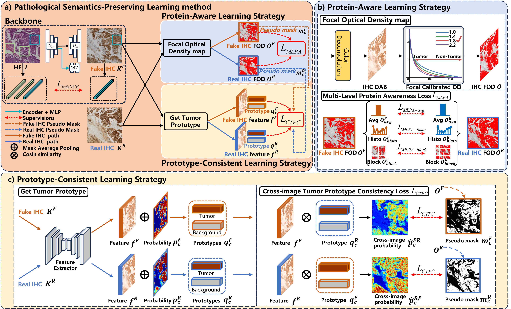

# PSPStain
Official implementation of "**Pathological Semantics-Preserving Learning for H&E-to-IHC Virtual Staining**" (MICCAI 2024)
### Fuqiang Chen, Ranran Zhang, Boyun Zheng, Yiwen Sun, Jiahui He, Wenjian Qin
<br>
<p align="center">

</p>
<br>
>Conventional hematoxylin-eosin (H&E) staining is limited to revealing cell morphology and distribution, whereas immunohistochemical (IHC) staining provides precise and specific visualization of protein activation at the molecular level. Virtual staining technology has emerged as a solution for highly efficient IHC examination, which directly transforms H&E-stained images to IHC-stained images. However,
 virtual staining is challenged by the insufficient mining of pathological semantics and the spatial misalignment of pathological semantics. To address these issues, we propose the Pathological Semantics-Preserving Learning method for Virtual Staining (PSPStain), which directly incorporates the molecular-level semantic information and enhances semantics interaction despite any spatial inconsistency. Specifically, PSPStain comprises two novel learning strategies: 1) Protein-Aware Learning Strategy (PALS) with Focal Optical Density (FOD) map maintains the coherence of protein expression level, which represents molecular-level semantic information; 2) Prototype-Consistent Learning Strategy (PCLS), which enhances cross-image semantic interaction by prototypical consistency learning. We evaluate PSPStain on two public datasets using five metrics: three clinically relevant metrics and two for image quality. Extensive experiments indicate that PSPStain outperforms current state-of-the-art H&E-to-IHC virtual staining methods and demonstrates a high pathological correlation between the staging of real and virtual stains.
 
# News
Code is stil updating.
checkpoint will be released.
metric process will be released.
## Requirements
```bash
conda env create -f environment.yml
```

## Dataset
 * Breast Cancer Immunohistochemical (BCI) challenge dataset
 * Multi-IHC Stain Translation (MIST) dataset 

 More information and downloading links of the former two datasets can be found in [page](https://bupt-ai-cz.github.io/BCI), and the RedWeb-S can be downloaded from this [project page](https://github.com/lifangda01/AdaptiveSupervisedPatchNCE).
 
💡**Important tips**💡
* train on different dataset, you need to change the pretrain unet model 'pretrain/BCI_unet_seg.pth' or 'pretrain/MIST_unet_seg.pth'.
## Training from Scratch
We use `experiments/mist_launcher.py` to generate the command line arguments for training and testing. More details on the parameters used in training our models can be found in that launcher file.

```bash
python -m experiments --name PSPStain --cmd train --id 0
```
## Testing and Evaluation
```bash
python -m experiments --name PSPStain --cmd test --id 0
```
## Acknowledgement
This repo is built upon [Contrastive Unpaired Translation (CUT)](https://github.com/taesungp/contrastive-unpaired-translation) and [Adaptive Supervised PatchNCE Loss (ASP)](https://github.com/lifangda01/AdaptiveSupervisedPatchNCE)
